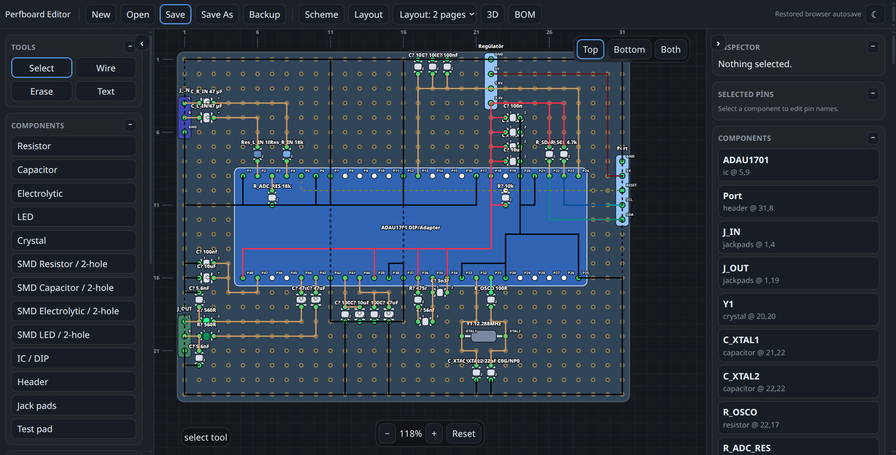

# Perfboard Editor

A lightweight, browser-based perfboard layout editor for planning through-hole and compact SMD-style builds on grid/perfboard prototypes.



## Features

- Interactive SVG-based perfboard editor
- Top, bottom, and both-side layer viewing
- Optional view controls for labels, pin names, rulers, opposite-side ghost wires, and wire/component drawing order
- Through-hole and compact two-hole SMD-style component footprints
- Wire routing with bend points
- Component inspector and editable pin names
- Basic electrical checks for floating pins and same-hole short risks
- Local project open/save, autosave, backup export
- Printable layout, schematic, and BOM outputs
- Optional 3D preview powered by Babylon.js CDN

## Run locally

No build step is required. Open `index.html` directly in a modern browser:

```text
index.html
```

For best results, use Chrome or Edge because the File System Access API allows saving back to the selected project file. Other browsers may fall back to download/backup behavior.

## Project structure

```text
index.html
css/app.css
js/app.js
js/core.js
js/model.js
js/render-2d.js
js/render-3d.js
js/print.js
js/storage.js
js/checks.js
```

## Notes

- The editor stores autosaves in the browser's local storage.
- The 3D view requires internet access unless Babylon.js is bundled locally.
- This tool is intended for layout planning and visual checking; always verify real circuits with a multimeter before powering hardware.

## License

This project is licensed under the MIT License. See [LICENSE](LICENSE) for details.
