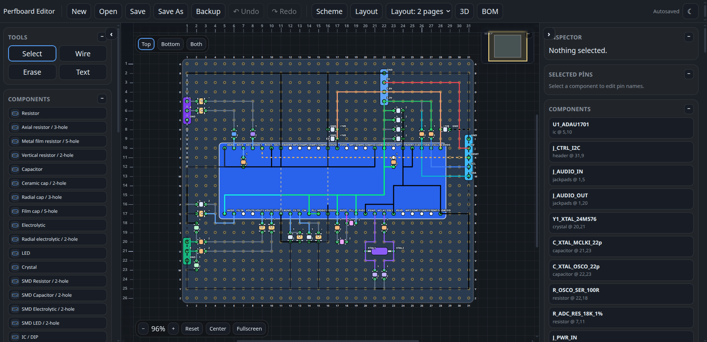
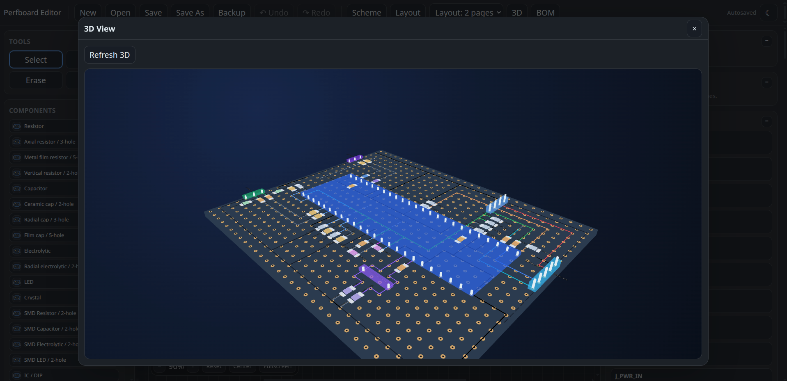
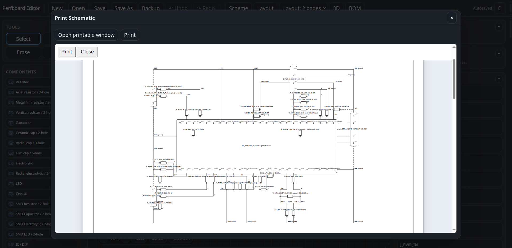
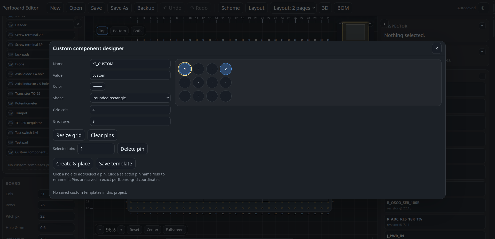
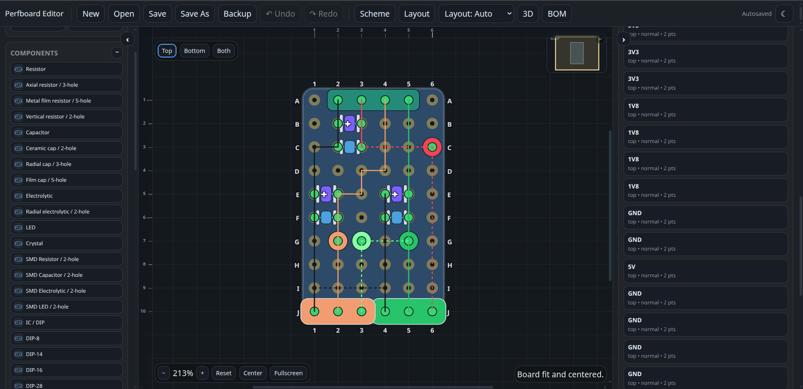
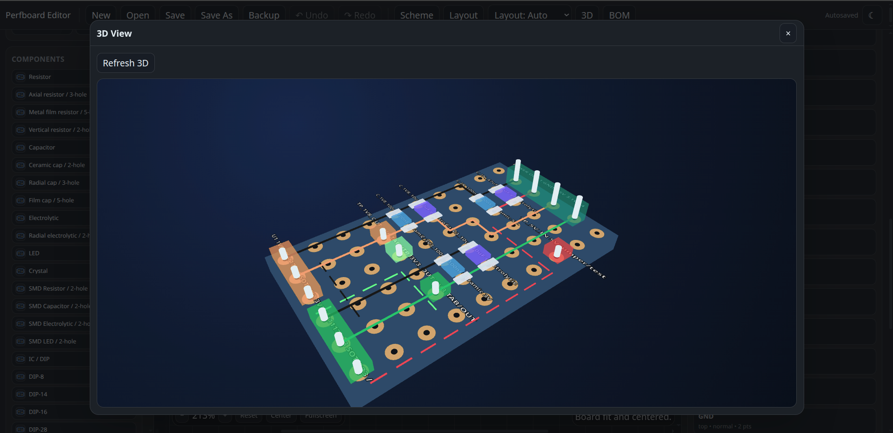

# Perfboard Editor

A lightweight, browser-based perfboard layout editor for planning through-hole and compact SMD-style builds on grid/perfboard prototypes.

## Live demo

The GitHub Pages deployment is available here:

[https://smhgzll.github.io/perfboard-editor/](https://smhgzll.github.io/perfboard-editor/)


## Screenshots

<table>
  <tr>
    <td></td>
    <td></td>
    <td></td>
  </tr>
  <tr>
    <td></td>
    <td></td>
    <td></td>
  </tr>
</table>

## Features

- Interactive SVG-based perfboard editor
- Top, bottom, and both-side layer viewing
- Optional view controls for labels, pin names, rulers, opposite-side ghost wires, and wire/component drawing order
- Through-hole, radial, axial, vertical-lead, and compact two-hole SMD-style component footprints
- Wire routing with bend points
- Component inspector and editable pin names
- Toolbar Undo/Redo plus a right-panel history list
- Adjustable component label and pin-name font sizes, with wrapped labels for dense layouts
- Full per-hole rulers and optional board-edge coordinate labels with switchable letter/number axes
- Jumper/insulated wire marking for visible atlama/izole routing
- Expanded component palette: DIP presets, screw terminals, diode, transistor, pots, TO-220, tactile switch, axial/vertical resistor footprints, radial/film capacitors, axial inductor, and more
- Custom component designer for grid-aligned footprints with selectable pins and simple body shapes; saved templates appear in the left palette
- Basic electrical checks for floating pins and same-hole short risks
- Local project open/save, autosave, backup export
- Printable layout, schematic, and BOM outputs
- Optional 3D preview powered by Babylon.js CDN

## Run locally

No build step is required. Open `index.html` directly in a modern browser:

```text
index.html
```

For best results, use Chrome or Edge because the File System Access API allows saving back to the selected project file. Other browsers may fall back to download/backup behavior.

## Project structure

```text
index.html
css/app.css
js/app.js
js/core.js
js/model.js
js/render-2d.js
js/render-3d.js
js/print.js
js/storage.js
js/checks.js
```

## Notes

- The editor stores autosaves in the browser's local storage.
- The 3D view requires internet access unless Babylon.js is bundled locally.
- This tool is intended for layout planning and visual checking; always verify real circuits with a multimeter before powering hardware.

## Changelog

### 2026-06-21 - Minimap, startup centering and panning refresh

- Made the minimap smaller and added a collapse/expand toggle in its own top-right control.
- Forced project load/refresh startup to fit and center the board so F5 no longer opens at a random offset.
- Improved middle-mouse panning responsiveness by throttling ruler/minimap refreshes and increasing panning travel slightly.
- Added workspace resize observation and delayed viewport refreshes after left/right panel collapse changes so fixed rulers and overlays realign without a manual refresh.
- Kept fullscreen view-only zoom/pan behavior and the existing editor tools intact.
- Custom components created from the designer are now automatically saved into the left Components palette as reusable project templates. Selecting a saved template enters custom placement mode so the same footprint can be placed repeatedly.
- Moved the selected-component focus label out of the SVG/canvas and into a fixed workspace badge near the layer buttons, so it no longer pans around with the board.
- Reworked the background/work grid so it is generated inside the SVG from the current perfboard pitch and margin, keeping grid spacing aligned with actual perfboard holes instead of the browser background.
- Improved label and pin-name placement with collision-aware candidate positions. Labels now try alternate sides/offsets before overlapping another label.
- Added more through-hole variants: axial resistor 3-hole, metal-film resistor 5-hole, vertical resistor 2-hole, ceramic/radial/film capacitor spacings, radial electrolytic, axial diode, and axial inductor.
- Added compact icons to the left component palette and custom-template rows.
- Moved zoom controls to the fixed upper-left workspace controls and added a Center button that scrolls the board back to the middle without changing ruler/grid math.
- Disabled the browser context menu on the editor SVG and added a small editor context menu for rotate, duplicate, delete, jumper/insulated wire toggles, cancel wire draft, and center board.
- Existing saved projects remain backward-compatible; no existing component/wire schema fields were removed.
- Default new board size is now 30 × 20 holes instead of the very large starter board.
- Added Undo/Redo buttons to the top toolbar and a History section in the right panel.
- Added label font size, pin-name font size, and label wrap controls to the Board section.
- Selected component labels are emphasized, and the newer fixed workspace badge keeps the focus label outside the panning canvas.
- Rulers now label every grid position instead of skipping by fives.
- Added board-edge coordinate labels. Board options can switch between top numbers/side letters and top letters/side numbers.
- Added jumper/insulated bridge type for selected wires so atlama/izole routes are visually distinct.
- Reworked new DIP/IC default pin layout to two opposing rows with pin 1 at the top-left. Add/remove on DIP-like components now preserves paired rows.
- Added more built-in components: DIP-8/14/16/28, 2P/3P screw terminals, diode, transistor, potentiometer, trimpot, TO-220 regulator, and 6×6 tactile switch.
- Added a custom component designer modal. Click grid holes to define pins, choose a simple body shape, save templates to the project, or enter placement mode.
- Existing JSON loading is kept backward-compatible; old projects are normalized without changing their saved component pin coordinates.
- Restored the ruler behavior to fixed editor-edge overlays instead of drawing rulers around the board body.
- Re-enabled middle-mouse panning in the normal editor view, including panning while the pointer leaves the SVG.
- Fullscreen view-only mode now keeps the zoom controls visible and supports wheel zoom plus mouse panning, while still blocking board edits.
- Added a top-right minimap that shows the board rectangle and the current viewport so it is easier to see where you are after panning away.
- Reworked the workspace grid as a subtle infinite background aligned to the board hole pitch; the perfboard surface itself is no longer covered by grid lines.
- Kept selected component labels on a top overlay layer and removed label shadow/filter artifacts that could create triangular glitches.
- Restored the perfboard surface look by drawing the workspace grid behind the board instead of over the board.
- Rebuilt the background workspace grid so it follows the same pitch and origin as the board holes.
- Moved zoom controls below the Top/Bottom/Both floater to avoid overlap.
- Made the left component palette more compact with smaller one-line ellipsis labels.
- Kept the view-only fullscreen button available in the zoom control group.

## License

This project is licensed under the MIT License. See [LICENSE](LICENSE) for details.
