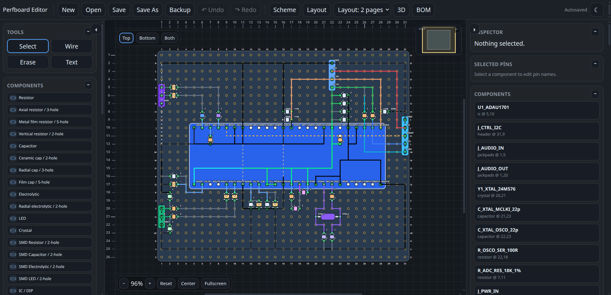
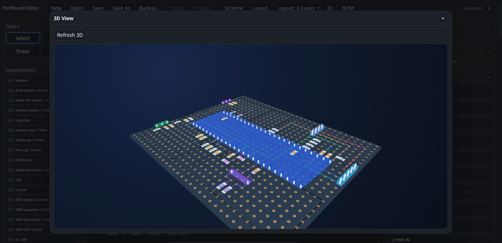
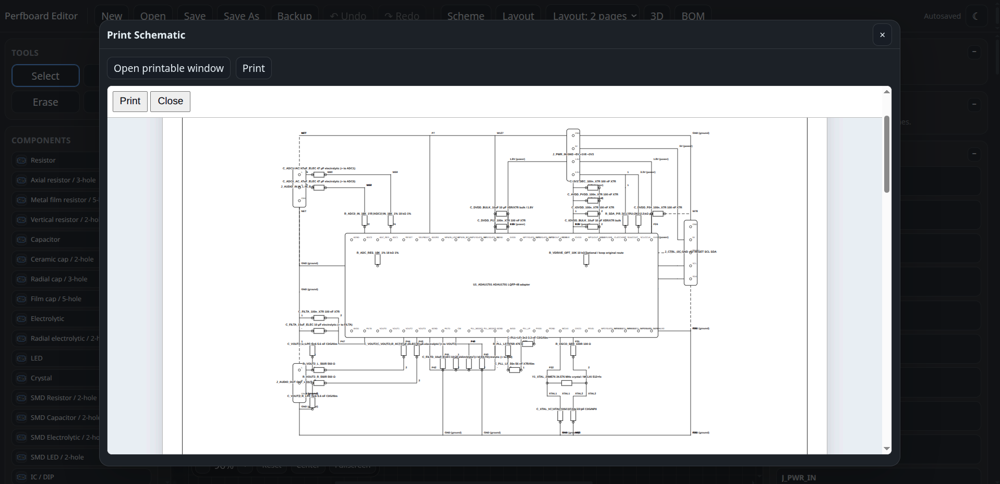
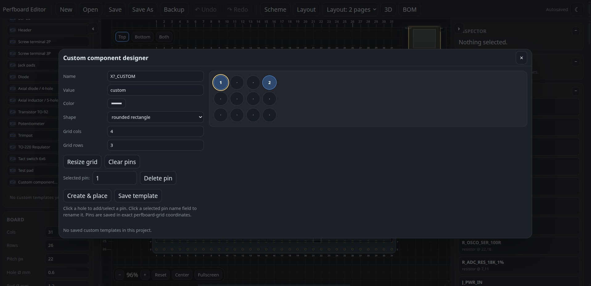
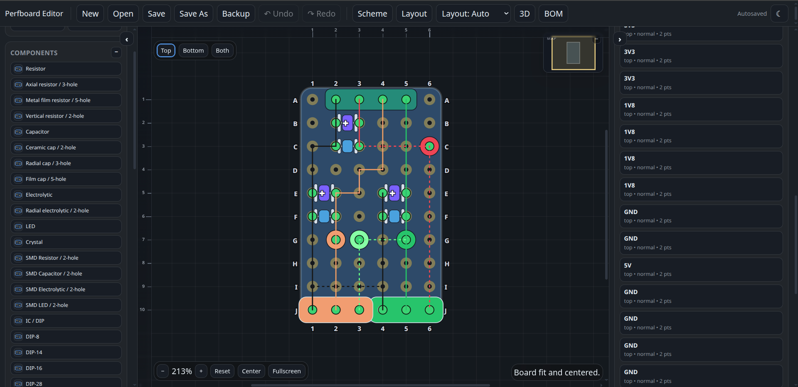
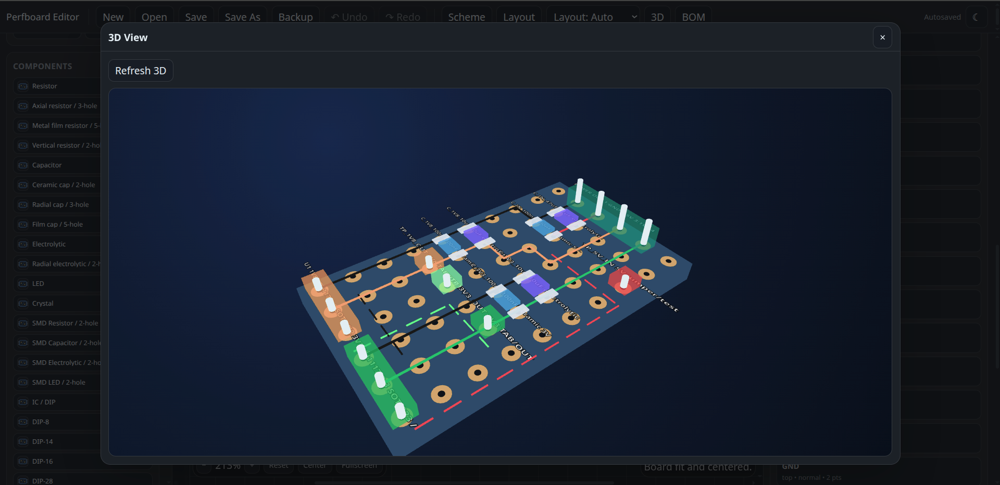

# Perfboard Editor

A lightweight, browser-based perfboard layout editor for planning through-hole and compact SMD-style builds on grid/perfboard prototypes.

## Live demo

The GitHub Pages deployment is available here:

[https://smhgzll.github.io/perfboard-editor/](https://smhgzll.github.io/perfboard-editor/)


## Screenshots

<table>
  <tr>
    <td></td>
    <td></td>
    <td></td>
  </tr>
  <tr>
    <td></td>
    <td></td>
    <td></td>
  </tr>
</table>

## Features

- Interactive SVG-based perfboard editor
- Top, bottom, and both-side layer viewing
- Optional view controls for labels, pin names, rulers, opposite-side ghost wires, and wire/component drawing order
- Through-hole, radial, axial, vertical-lead, and compact two-hole SMD-style component footprints
- Wire routing with bend points
- Component inspector and editable pin names
- Toolbar Undo/Redo plus a right-panel history list
- Adjustable component label and pin-name font sizes, with wrapped labels for dense layouts
- Full per-hole rulers and optional board-edge coordinate labels with switchable letter/number axes
- Jumper/insulated wire marking for visible atlama/izole routing
- Expanded component palette: DIP presets, screw terminals, diode, transistor, pots, TO-220, tactile switch, axial/vertical resistor footprints, radial/film capacitors, axial inductor, and more
- Custom component designer for grid-aligned footprints with selectable pins and simple body shapes; saved templates appear in the left palette
- Connectivity checks for unconnected pins, conflicting net names and off-board objects
- Local project open/save, autosave, backup export
- Printable layout, schematic, and BOM outputs
- Procedural 3D component models with lit metal/plastic materials, open board holes, camera presets, X-ray and PNG export; Babylon.js is loaded on demand and disposed when the dialog closes
- Searchable, categorized component library with individual SVG icons
- Responsive library/inspector drawers, object search and keyboard shortcuts
- Editable text notes, group movement/duplication and draggable wire points
- Project recovery snapshots, validated imports and preserved legacy coordinates
- CSV BOM and physically scaled SVG layout downloads
- Horizontal/vertical stripboard copper, cuts between pads and solder bridges
- Planned pin nets, missing-connection guides and a live connection plan
- Project notebook, assembly checklist and printable copper work sheet
- Connectivity JSON export separating physical islands from intended nets

## Run locally

No build step or dependencies are required. Use Node.js 20 or later:

```sh
npm start
```

Open **http://localhost:3000**. Set `PORT` to use another port. Any static HTTP server also works; opening `index.html` as a `file://` URL does not support the JavaScript modules in Chrome.

Chrome and Edge support saving back to an opened file. Other browsers download the project instead. Browser autosave and file save are shown separately in the project header.

### Validation

```sh
npm test
```

The tests cover both legacy examples, model validation, component placement, connectivity and recovery. Optional browser tests use Python Playwright and a locally installed Chrome/Chromium:

```sh
python3 tests/browser_smoke.py
python3 tests/browser_copper.py
python3 tests/browser_3d.py
python3 tests/browser_print.py
```

The browser test starts its own local Node server and blocks external requests. It covers placement, dragging, notes, multi-selection, recovery, exports and responsive panels, including the offline 3D error state.

The copper browser test covers strip cuts/bridges, planned routing, notebook recovery, connection/worksheet exports and mobile copper tools. 3D domain tests verify open holes, copper gaps, continuous wires and every catalog pin at four rotations on both mounting faces without requiring a GPU.

The 3D browser test uses real Babylon.js with Chrome software WebGL. It checks all 49 models, existing projects, camera views, selection, X-ray, layer switches, PNG download, full screen, mobile layout and resource disposal. Only the Babylon runtime may load from the CDN; pass `--babylon /path/to/babylon.js` to use a local copy and block all external requests.

The print browser test checks rendered pin positions, mirrored readable coordinates, display options, full parts/notes keys, SVG export and mobile preview with external requests blocked. When Poppler is installed it also verifies actual A4 PDF pagination and produces a full-page preview in `/tmp`.

### Board layout printing

Choose **Export → Print board layout** for separate component and solder-side drawings. Short references identify parts without long names covering the connections; the optional **Parts & notes key** includes complete names, values, mounting faces, rotation, anchor positions and the first pin's coordinates. N-numbered markers point to the full board notes in that key.

The bottom view mirrors columns and keeps text upright. Both diagrams show hole coordinates; lettered rows continue from Z to AA, with A = row 1. A square pad marks the first listed pin on multi-pin parts. Light dashed bodies identify parts on the opposite face; hiding those outlines still retains physical through-hole contacts. Solid wires are bare conductors and dashed wires are insulated or jumpers. Junction dots use actual wire contacts, so insulated crossings do not gain a connection.

Use the preview controls to include values or pin names, hide opposite-face outlines, omit the parts/notes key, or switch to black and white. **Automatic** gives dense boards a page per face to keep references readable; **Side by side** and **Separate pages** remain available. These preview settings do not change the project. Drawings fit the page rather than printing at 1:1; the stated millimeter dimensions describe the board. Downloaded layout SVG files remain vector drawings with physical units and the same print styling.

### 3D preview

Open **3D** for separate resistor, capacitor, LED, DIP, connector, transistor and other package models. Drag to orbit, right-drag to pan and scroll or pinch to zoom. **Top**, **Bottom**, **Front** and **Fit** help inspect either face; the bottom preset mirrors columns consistently with bottom assembly prints.

Toggle parts, wires, copper and reference labels; use **X-ray** to inspect connections through bodies or **Lift parts** to separate the assembly. Click a component to see its reference, value, mounting face and pin count. **Save PNG** downloads the current canvas view. Display options are temporary and do not modify the project.

Pin positions and rotations follow saved footprints. Body sizes are illustrative rather than manufacturer mechanical dimensions. Boards with up to 2,000 holes have actual open geometry; larger boards use instanced hole markers and simpler copper geometry to limit memory use. A failed library load can be retried with **Refresh**.

### Editing

- Search or filter the library, select a part, then click the board. **R** rotates the preview; **Esc** finishes repeated placement.
- **V / W / E / T** select the selection, wire, eraser and note tools.
- **Shift+click** selects multiple objects, or adds bends while routing. **Ctrl/Cmd+D** duplicates the selection.
- Select a wire to drag its handles. Double-click a selected segment at a grid hole to add a point. Inspector route fields use one-based coordinates.
- Hold **Space** and drag (or use middle mouse) to pan. **Ctrl/Cmd+wheel** zooms around the pointer. **F** fits the board.
- **Project → Browse examples** opens either included layout. **Recover previous work** restores snapshots kept when switching projects (up to 20 in this browser).
- Custom templates preserve their pin numbers and can be imported/exported as a component library.
- **C / B** select cut/restore and solder bridge tools, also available in the toolbar's **⋯** menu.

### Copper boards and connection planning

Choose **Board → Board type → Stripboard**, select the copper direction and apply. Copper strips run on the **bottom** face; top view can show them as a ghost. Stripboard through-hole leads contact the bottom copper even with PTH off; compact SMD entries contact their mounting face. A new stripboard selection turns PTH off in the form, where it can be explicitly enabled again.

The cut tool snaps to the gap **between** two pads along a strip. Both holes remain usable. Click the same gap to restore continuity. A solder bridge joins two neighboring holes on the current face (bottom when viewing both); click the same pair again to remove it. Use **⋯ → Cuts & bridges** to locate or remove operations. Changes support undo/redo. Changing the board type or strip direction retains existing cuts and checks report inactive cuts.

Select a component and set **Plan net** on its pins. Equal names express intended connections. The **Connection plan** panel and dashed guides show physically separate islands that still need a route. Click a net to highlight its copper/wires, or **Route …** to start drawing from one of the missing contacts. A guide disappears once real copper connects its islands. Normalized names such as `3.3V` and `3V3` describe the same intended net. NC pins are excluded from guides.

Checks also report copper joining different net names, shared holes, connected NC pins and bare bottom routes bypassing cuts. The connection JSON export records physical islands and missing intended connections separately, using one-based column/row coordinates.

Try **Project → Browse examples → Stripboard LED indicator** for an original example with a cut, solder bridge and one remaining connection.

### Notebook and assembly

**Project → Project notebook** stores design notes and a checklist with the project, autosaving edits in the browser. Download it as Markdown, or choose **Export → Print assembly worksheet** for notes, tasks and a coordinate list of all cuts/bridges. Coordinates use the top view, counted from 1. The printed bottom layout is mirrored, so column 1 appears on the right. Copper work also appears in bottom SVG and 3D geometry.

The feature review and implementation choices are recorded in [docs/LochCAD-review.md](docs/LochCAD-review.md).

### Footprints and checks

The 49-entry library includes 15 additional footprints: SOT-223 grid adapter, MOSFET TO-220, double-row header, 4-pole terminal, Zener and Schottky diodes, bridge adapter, slide switch adapter, DIP switch, fuse, buzzer and DIP-18/20/24/40. Adapter entries describe grid-aligned breakout connections; they are not native SMD land patterns. Set the pin names to match the physical part or adapter. Existing projects retain their saved pin coordinates, including older terminal footprints.

Layout checks share the connectivity model used for pin indicators and net highlighting. Bare routes contact at grid holes. Insulated wires/jumpers contact only at their ends. Opposite faces connect through PTH at route nodes or component pins. Conflicting names produce a warning to inspect the joint or rename the connected routes; automatic W-number names are ignored. Mark intentionally unused pins **NC** in the inspector.

These checks do not model internal IC/switch connections or simulate circuit behavior. “Keep attached wire points” moves existing route nodes at the component pins; free crossings are not automatically rerouted. The connection sketch remains a projection of the layout, not a schematic editor.

## Project structure

```text
index.html
css/app.css
js/app.js
js/core.js
js/model.js
js/render-2d.js
js/render-3d.js
js/print.js
js/layout-print.js
js/storage.js
js/checks.js
js/connectivity.js
js/catalog.js
js/panels.js
js/validation.js
js/copper.js
js/networks.js
js/assembly.js
server.js
tests/
```

## Notes

- The editor stores autosaves in the browser's local storage.
- The 3D view requires internet access unless Babylon.js is bundled locally.
- This tool is intended for layout planning and visual checking; always verify real circuits with a multimeter before powering hardware.

## Changelog

### Board layout print improvements

- Added package outlines, hole coordinates, first-pin markers and separate styling for the mounted and opposite faces.
- Replaced long overlapping annotations with collision-aware short references and complete parts/notes keys.
- Added readable mirrored coordinates, wire halos, physical junction dots, insulated wire conventions and grayscale output.
- Added preview settings, readable automatic page arrangement and A4 pagination fixes, with domain and PDF/browser regression checks.

### 3D preview improvements

- Replaced generic translucent boxes with original procedural package models and physical metal/plastic materials, lighting and shadows.
- Added open board/copper holes, resistor bands, package details, continuous rounded wires and solder joints.
- Added camera presets, small-board zoom, layer switches, reference labels, component picking, X-ray, lifted assembly, auto rotation, full screen and PNG export.
- Added real WebGL regression coverage, responsive controls and disposal checks.

### 1.4.0 — Copper planning and assembly workflow

- Added horizontal/vertical stripboards, gap cuts and face-specific solder bridges with undo/redo.
- Unified strip copper, wires, bridges and pin contacts in the continuity graph.
- Added pin net planning, minimum-distance routing guides, net highlighting and connection JSON export.
- Added copper conflicts, missing nets, shared holes, NC continuity and bypassed/inactive cut checks.
- Added autosaved project notes, assembly tasks, Markdown export and a printable assembly worksheet.
- Included copper operations in mirrored bottom print/SVG and 3D geometry.
- Added an original LED stripboard example and domain/browser regression tests.

### 1.3.0 — Editor and reliability update

- Rebuilt the workbench layout with searchable categories, dedicated Board/View tabs, accessible dialogs and responsive drawers.
- Fixed text notes, print windows, board form synchronization after Undo, same-hole wire handling, file picker error handling and no-op move history.
- Added project recovery, safe imports, unique ID repair, bounds checks and file/browser save status.
- Added 15 component variants, multi-selection, wire handle editing, pin NC flags, consistent coordinates and template import/export.
- Reduced hover work to a transient SVG layer and retained the static board across redraws.
- Added a dependency-free Node server, domain regression tests and optional browser smoke tests.


### 2026-06-21 - Minimap, startup centering and panning refresh

- Made the minimap smaller and added a collapse/expand toggle in its own top-right control.
- Forced project load/refresh startup to fit and center the board so F5 no longer opens at a random offset.
- Improved middle-mouse panning responsiveness by throttling ruler/minimap refreshes and increasing panning travel slightly.
- Added workspace resize observation and delayed viewport refreshes after left/right panel collapse changes so fixed rulers and overlays realign without a manual refresh.
- Kept fullscreen view-only zoom/pan behavior and the existing editor tools intact.
- Custom components created from the designer are now automatically saved into the left Components palette as reusable project templates. Selecting a saved template enters custom placement mode so the same footprint can be placed repeatedly.
- Moved the selected-component focus label out of the SVG/canvas and into a fixed workspace badge near the layer buttons, so it no longer pans around with the board.
- Reworked the background/work grid so it is generated inside the SVG from the current perfboard pitch and margin, keeping grid spacing aligned with actual perfboard holes instead of the browser background.
- Improved label and pin-name placement with collision-aware candidate positions. Labels now try alternate sides/offsets before overlapping another label.
- Added more through-hole variants: axial resistor 3-hole, metal-film resistor 5-hole, vertical resistor 2-hole, ceramic/radial/film capacitor spacings, radial electrolytic, axial diode, and axial inductor.
- Added compact icons to the left component palette and custom-template rows.
- Moved zoom controls to the fixed upper-left workspace controls and added a Center button that scrolls the board back to the middle without changing ruler/grid math.
- Disabled the browser context menu on the editor SVG and added a small editor context menu for rotate, duplicate, delete, jumper/insulated wire toggles, cancel wire draft, and center board.
- Existing saved projects remain backward-compatible; no existing component/wire schema fields were removed.
- Default new board size is now 30 × 20 holes instead of the very large starter board.
- Added Undo/Redo buttons to the top toolbar and a History section in the right panel.
- Added label font size, pin-name font size, and label wrap controls to the Board section.
- Selected component labels are emphasized, and the newer fixed workspace badge keeps the focus label outside the panning canvas.
- Rulers now label every grid position instead of skipping by fives.
- Added board-edge coordinate labels. Board options can switch between top numbers/side letters and top letters/side numbers.
- Added jumper/insulated bridge type for selected wires so atlama/izole routes are visually distinct.
- Reworked new DIP/IC default pin layout to two opposing rows with pin 1 at the top-left. Add/remove on DIP-like components now preserves paired rows.
- Added more built-in components: DIP-8/14/16/28, 2P/3P screw terminals, diode, transistor, potentiometer, trimpot, TO-220 regulator, and 6×6 tactile switch.
- Added a custom component designer modal. Click grid holes to define pins, choose a simple body shape, save templates to the project, or enter placement mode.
- Existing JSON loading is kept backward-compatible; old projects are normalized without changing their saved component pin coordinates.
- Restored the ruler behavior to fixed editor-edge overlays instead of drawing rulers around the board body.
- Re-enabled middle-mouse panning in the normal editor view, including panning while the pointer leaves the SVG.
- Fullscreen view-only mode now keeps the zoom controls visible and supports wheel zoom plus mouse panning, while still blocking board edits.
- Added a top-right minimap that shows the board rectangle and the current viewport so it is easier to see where you are after panning away.
- Reworked the workspace grid as a subtle infinite background aligned to the board hole pitch; the perfboard surface itself is no longer covered by grid lines.
- Kept selected component labels on a top overlay layer and removed label shadow/filter artifacts that could create triangular glitches.
- Restored the perfboard surface look by drawing the workspace grid behind the board instead of over the board.
- Rebuilt the background workspace grid so it follows the same pitch and origin as the board holes.
- Moved zoom controls below the Top/Bottom/Both floater to avoid overlap.
- Made the left component palette more compact with smaller one-line ellipsis labels.
- Kept the view-only fullscreen button available in the zoom control group.

## License

This project is licensed under the MIT License. See [LICENSE](LICENSE) for details.
