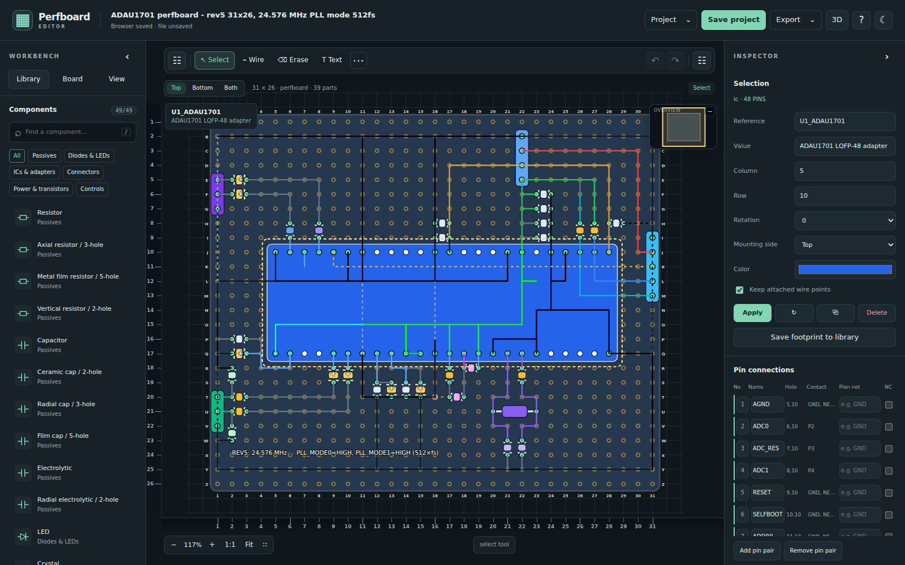
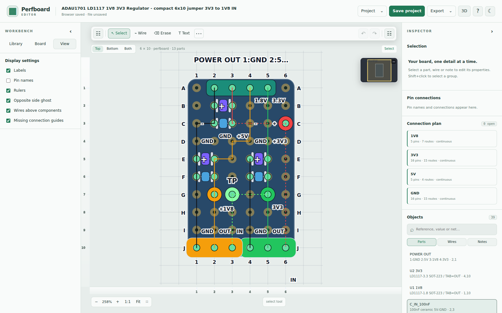
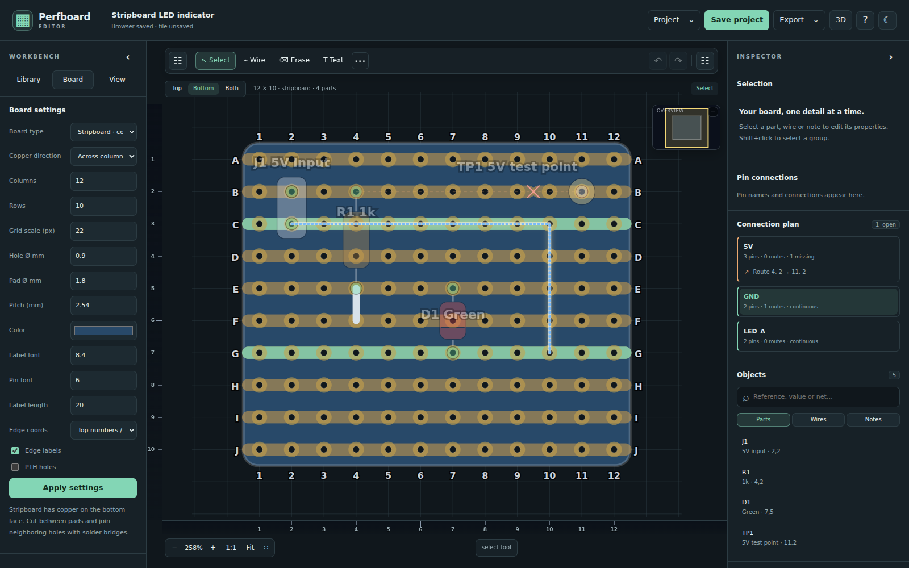
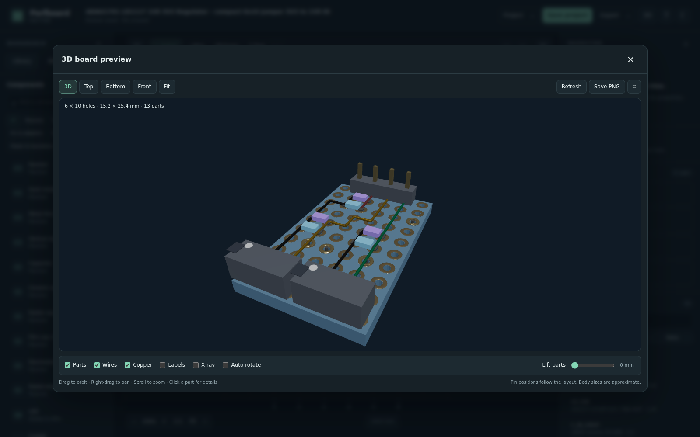
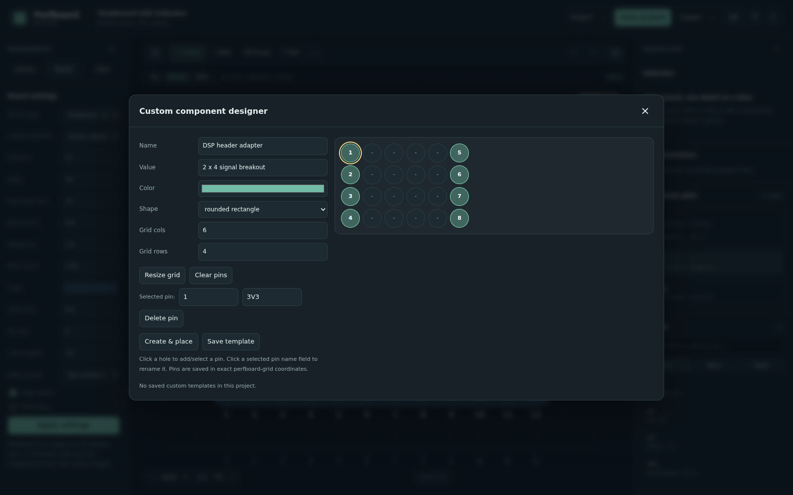
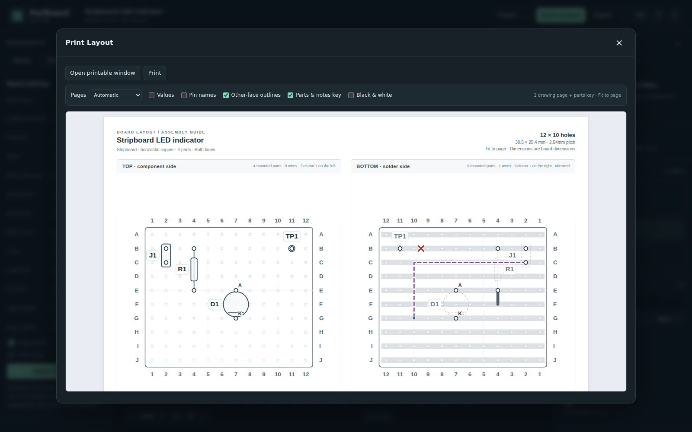
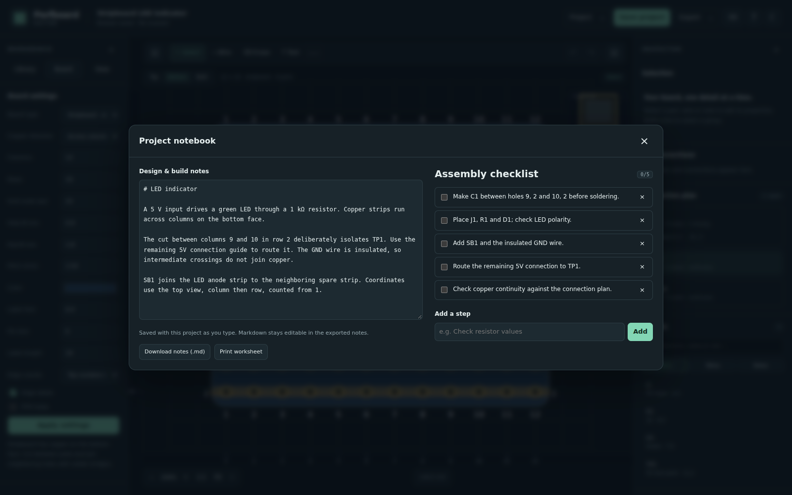

# Perfboard Editor

A browser-based workbench for planning perfboard and stripboard assemblies. Place components on a hole grid, route both faces, plan connections, inspect copper continuity, preview the assembly in 3D, and export build drawings and parts lists.

**[Open the live demo](https://smhgzll.github.io/perfboard-editor/)** · [Run locally](#run-locally) · [Getting started](#getting-started) · [Keyboard shortcuts](#keyboard-shortcuts)

The 2D editor runs without a build step or third-party runtime dependencies. Projects, custom footprints, copper operations and assembly notes are saved together in JSON files; browser autosave keeps a local working copy. The optional 3D viewer loads Babylon.js on demand.

## Gallery

These screenshots were captured from the current interface on October 2, 2026, using the included example projects.

<table>
  <tr>
    <td width="50%"><a href="assets/gallery/workbench-dark.png"></a><br><b>Desktop workbench</b> — library, layout and inspector.</td>
    <td width="50%"><a href="assets/gallery/labels-light.png"></a><br><b>Light theme and annotations</b> — labels, pin names and view settings.</td>
  </tr>
  <tr>
    <td><a href="assets/gallery/stripboard-planning.png"></a><br><b>Stripboard planning</b> — copper continuity and missing connections.</td>
    <td><a href="assets/gallery/preview-3d.png"></a><br><b>3D assembly preview</b> — camera presets and layer controls.</td>
  </tr>
  <tr>
    <td><a href="assets/gallery/custom-component.png"></a><br><b>Custom footprints</b> — grid positions, pin names and reusable templates.</td>
    <td><a href="assets/gallery/layout-print.png"></a><br><b>Assembly drawings</b> — readable top and bottom layouts.</td>
  </tr>
  <tr>
    <td><a href="assets/gallery/project-notebook.png"></a><br><b>Project notebook</b> — build notes and assembly checklist.</td>
  </tr>
</table>

Click a screenshot to open it at full resolution.

## Getting started

1. Open the live demo or start the local server. Choose **Project → Browse examples** to explore a completed layout, or **New project** to start with a 30 × 20-hole board.
2. Open the **Board** tab to set the board dimensions, physical pitch, pad/hole sizes, color and plated-through-hole behavior. Choose perfboard or stripboard, then **Apply settings**.
3. Search the **Library**, choose a component and click a hole to place it. Press **R** to rotate the placement preview. Placement repeats until you press **Esc**.
4. Select a part to edit its reference, value, mounting face, position, rotation, color and pins in the inspector. Assign **Plan net** names to contacts that should connect.
5. Use **Wire** to start a route. **Shift+click** adds bend points; a normal click finishes it. Select a route to edit its handles, net, layer and conductor type.
6. Inspect **Connection plan** and **Layout checks**. Add strip cuts or solder bridges when using stripboard, and keep build notes in the **Project notebook**.
7. Save the project, inspect **3D**, then use **Export** for board drawings, a BOM, connection data or an assembly worksheet.

## Workbench and navigation

The left panel contains **Library**, **Board** and **View** tabs. The right panel contains the selection inspector, editable pin connections, connection plan, searchable objects, layout checks and undo history. Both panels collapse on desktop and become drawers on smaller screens.

### Touch editing limitations

The interface adapts to phone and tablet screen widths, but the editing workflow still relies on mouse and keyboard interactions. In the 2D editor, two-finger panning and pinch zoom are not implemented; multi-selection and adding bends during wire routing require Shift. Small buttons and pin/wire targets make precise touch editing difficult, and hover tooltips are not a reliable way to read full names on touchscreens. Basic placement and dragging use pointer events, but real-device touch usability has not been validated. Detailed editing is currently better suited to a mouse and keyboard.

### Display and navigation controls

- **Top / Bottom / Both** select the displayed face. Opposite-face components and routes can appear as ghosts.
- **View** independently controls component labels, pin names, rulers, opposite-side ghosts, wires above components and missing-connection guides.
- Labels use measured SVG text bounds to avoid other annotations, pins, edge coordinates and notes. Nearby alternatives are tried first; labels that cannot fit are omitted. Full component and pin names remain available through hover tooltips. Board settings control label font, pin font and maximum label length; long text is shortened with an ellipsis.
- Fixed rulers show individual grid positions. Optional board-edge coordinates use top numbers/side letters or top letters/side numbers; letters continue from Z to AA.
- Hold **Space** and drag, or drag with the middle mouse button, to pan. **Ctrl/Cmd+wheel** zooms around the pointer. The footer offers zoom in/out, **1:1**, **Fit** and view-only fullscreen.
- The minimap shows the board and visible area, supports navigation and can be collapsed. Loading a project fits and centers the board.
- The selected part's reference appears in a fixed workspace badge. The status bar and cursor coordinates report the active editing operation and grid position.
- Light and dark themes are available from the header. Right-click a board object for contextual rotate, duplicate, delete and wire-type actions; empty-space actions include centering and cancelling a draft route.

## Components and custom footprints

The searchable, categorized library contains **49 built-in footprints**, each with an SVG icon:

| Category | Included components |
| --- | --- |
| Passives | Resistor; 3-hole axial, 5-hole metal-film and 2-hole vertical resistors; capacitor; 2-hole ceramic, 3-hole radial and 5-hole film capacitors; electrolytic and 2-hole radial electrolytic; crystal; compact 2-hole SMD resistor, capacitor and electrolytic; 5-hole axial inductor; axial fuse |
| Diodes & LEDs | LED and compact 2-hole SMD LED; diode and 4-hole axial diode; Zener and Schottky diodes |
| ICs & adapters | Generic IC/DIP; DIP-8, 14, 16, 18, 20, 24, 28 and 40 |
| Connectors | Header; double-row 2×5 header; 2P, 3P and 4P screw terminals; jack pads; test pad |
| Power & transistors | TO-92 transistor; TO-220 regulator and MOSFET; SOT-223 grid adapter; bridge rectifier adapter |
| Controls | Potentiometer; trimpot; 6×6 tactile switch; SPDT slide-switch adapter; four-position DIP switch; two-pin buzzer |

Select a component to change its reference, value, one-based column/row, rotation in 90° steps, mounting face and color. Two-pin parts expose lead spacing; headers expose pin count. The pin panel shows pin numbers, editable names, coordinates, physical contact/net status, intended net names and **NC** flags. Pins can be added or removed; DIP-like parts use paired rows. New DIP footprints place pin 1 at the top-left, while imported projects keep their saved pin coordinates.

**Keep attached wire points** follows existing contact nodes when editing a component's footprint or placement. It does not automatically reroute free wire crossings.

Choose **Create custom component** to define a footprint on a configurable grid. Add/select/delete pins, edit their numbers and names, and choose a rounded rectangle, rectangle, ellipse, circle or pins-only body. Set the name, value and color, then **Save template** or **Create & place**. Templates appear under **Your components** for repeated placement and remain in the project. An existing part can also be saved with **Save footprint to library**. Use **Import library / Export library** to transfer templates between projects.

Compact SMD entries and adapter footprints describe grid-aligned prototype connections. Match their spacing and pin names to the physical adapter you intend to use; they are not native PCB land patterns.

## Routes, notes and editing

Routes snap to the hole grid and can contain multiple bend points. The wire inspector edits net name, top/bottom/jumper layer, color, solid/dashed style, bare/insulated/jumper type and one-based route coordinates. Selected routes expose draggable handles; double-click a selected segment at a grid hole to add a point. The eraser tool removes routes.

Use the **Text** tool to add board notes, then edit their text, position, size and color in the inspector. Notes are included in layout exports and print keys.

**Shift+click** toggles objects in a group selection. Drag a selected object to move the group; duplicate or delete it together. Single parts, routes and notes can also be duplicated or deleted. Object tabs separate parts, wires and notes, with search by reference, value, net or text. Clicking an object or a check finding locates it on the board.

Undo/redo is available through toolbar buttons, keyboard shortcuts and the history panel. Placement, moves, component edits, routes, copper operations and assembly checklist changes participate in project history.

## Board geometry and copper

**Perfboard** uses separate pads. **Stripboard** adds continuous bottom copper strips across columns or rows. Board settings include column/row count, screen grid scale, physical pitch in millimeters, hole and pad diameters, board color, edge coordinates and PTH mode.

- **PTH holes** allow continuity between top and bottom contacts. Stripboard through-hole leads contact bottom copper even when PTH is off; compact SMD entries contact their mounting face.
- Selecting stripboard in the form initially disables PTH; it can be explicitly enabled again.
- **Cut strip** snaps to the gap between neighboring pads along a strip. Both holes remain usable. Click the same gap again to restore continuity; activating the cut tool switches to the bottom view.
- **Solder bridge** joins neighboring holes on the current face, using bottom when viewing both. Click the same pair again to remove it.
- Open **⋯ → Cuts & bridges** to inspect, locate or remove copper operations. Cuts and bridges support undo/redo.
- Changing board type or copper direction preserves existing cuts. Checks identify cuts that are inactive in the new settings.

Copper operations are represented in the editor, connectivity graph, mirrored bottom drawings, SVG exports, assembly worksheet and 3D geometry.

## Connection planning and layout checks

Assign **Plan net** names to component pins to describe intended connections. Pins with the same normalized name belong to the same planned net; for example, `3.3V` and `3V3` are equivalent. Mark intentionally unused pins **NC** to exclude them from missing-connection guides.

The **Connection plan** lists intended nets and the physical islands that remain separate. Dashed guides suggest connections between islands. Select a net to highlight its copper and routes, or choose **Route …** to start drawing from a missing contact. Guides disappear when real copper, wires or bridges complete the connection.

The shared connectivity model treats bare conductors as contacts at grid holes. Insulated wires and jumpers contact at their endpoints, so an insulated crossing does not create a junction. Opposite faces connect through PTH at contact nodes. Automatic W-number net names are ignored when identifying conflicting named nets.

**Run checks** reports:

- Empty routes and objects outside the board.
- Unconnected pins and connected pins marked NC.
- Multiple leads sharing a hole and duplicate component references.
- Copper joining conflicting net names and missing planned connections.
- Inactive strip cuts and cuts bypassed by bare bottom routes.

Each applicable finding can be clicked to locate the object or grid position. Checks describe layout continuity; they do not simulate components, internal IC/switch connections or circuit behavior. The connection sketch is a projection of the layout rather than an editable schematic.

## Notebook and assembly

Open **Project → Project notebook** to keep design notes, measurements, part choices and build instructions with the project. Notes autosave as you type. The assembly checklist supports adding/removing tasks, marking them complete and tracking progress.

**Download notes (.md)** exports notes, checklist status and copper work as Markdown. **Print worksheet**, also available through **Export → Print assembly worksheet**, produces a build sheet with notes, tasks, remaining planned connection count and a coordinate list of all cuts and bridges, including inactive operations.

Worksheet coordinates are one-based in the top view. On a mirrored bottom drawing, column 1 appears on the right.

## Saving, recovery and example projects

**Save project**, **Save as…**, **Open project…** and **Download backup** use `.perfboard.json` files containing board settings, components, wires, notes, custom templates, planned nets, copper operations and the notebook.

Chrome/Edge can write back to an opened file through the File System Access API when available. Browsers without that API download files instead. The header distinguishes browser autosave from a saved project file.

Browser local storage restores the active working copy on startup. Switching projects archives previous work; **Project → Recover previous work** lists up to 20 snapshots stored in that browser. Recovery data belongs to that browser/origin, so download a project file to transfer work to another device. Imports are validated before replacing the current project, repair duplicate IDs where supported and preserve legacy footprint coordinates. Project files opened through the file picker are limited to 10 MB.

**Project → Browse examples** includes:

| Example | What it demonstrates |
| --- | --- |
| [ADAU1701 perfboard](examples/ADAU1701_perfboard_rev5_example.perfboard.json) | A dense DSP adapter layout with many parts, named pins and routes |
| [Compact LD1117 regulator](examples/ADAU1701_LD1117_1V8_3V3_Regulator_compact_6x10_jumper.perfboard.json) | A 6 × 10-hole 1.8 V / 3.3 V regulator layout with jumper routing |
| [Stripboard LED indicator](examples/Stripboard_LED_indicator.perfboard.json) | Bottom copper, a strip cut, solder bridge, planned nets, notebook tasks and one remaining connection |

## Printing and exports

| Action | Output |
| --- | --- |
| Print board layout | Separate component and solder-face drawings, with an optional complete parts/notes key |
| Print connection sketch | A projected connection overview generated from the layout |
| Bill of materials | Printable parts list |
| Download BOM (.csv) | Parts data for spreadsheet use |
| Download layout (.svg) | Vector board layouts with physical units and assembly drawing styling |
| Print assembly worksheet | Notes, checklist and coordinate-based copper operations |
| Download connections (.json) | Physical islands, intended nets and missing planned connections, with one-based coordinates |
| Notebook: Download notes (.md) | Design notes, checklist and copper work |
| 3D: Save PNG | The current rendered 3D canvas view |
| Import/Export library | Reusable custom component templates in JSON |

Print previews provide a direct print action and a separate printable window. The browser's print dialog can also save a PDF.

### Board layout drawings

Short component references identify parts without long labels covering connections. The optional **Parts & notes key** includes complete names, values, mounting faces, rotation, anchor positions and first-pin coordinates. N-numbered markers refer to the full board notes.

The solder-side drawing mirrors columns while keeping text and coordinates upright. Both faces show hole coordinates, with A = row 1 and letters continuing after Z. A square pad marks the first listed pin of multi-pin parts. Light dashed outlines show opposite-face components; hiding them retains physical through-hole contacts. Solid wires indicate bare conductors, while dashed wires indicate insulated conductors/jumpers. Junction dots follow physical contacts.

Preview controls toggle **Values**, **Pin names**, **Other-face outlines**, **Parts & notes key** and **Black & white**. **Automatic** uses separate drawing pages for dense boards; **Side by side** and **Separate pages** can be selected explicitly. These options affect the preview rather than the saved layout.

Printed drawings fit the page and are not guaranteed to be 1:1. Reported millimeter dimensions describe the board. SVG downloads use physical units and retain vector geometry.

## 3D preview

Open **3D** to inspect procedural models of resistors, capacitors, LEDs, DIPs, connectors, transistors and other packages. Models include resistor bands, metal leads, plastic bodies, board/copper holes, continuous rounded wire routes and solder joints.

- Drag to orbit, right-drag to pan, and scroll or pinch to zoom.
- Use **3D / Top / Bottom / Front / Fit** camera controls. The bottom preset mirrors columns consistently with solder-face drawings.
- Toggle **Parts**, **Wires**, **Copper** and reference **Labels** independently.
- Enable **X-ray** to see connections through component bodies; **Lift parts** separates the assembly for inspection.
- **Auto rotate** turns the assembly. Click a component to highlight it and show its reference, value, mounting face and pin count.
- Use fullscreen for a larger canvas, **Save PNG** for an image, and **Refresh** to rebuild or retry a failed runtime load.

Display options are temporary. Pin locations and rotations follow saved footprints; body sizes are illustrative rather than manufacturer mechanical dimensions. Boards with up to 2,000 holes use open-hole geometry. Larger boards use hole markers and simpler copper geometry to reduce memory use.

Babylon.js is fetched from `https://cdn.babylonjs.com/babylon.js` only when the viewer opens. The 2D editor remains usable if the load fails. Closing the viewer disposes its scene and engine resources.

## Keyboard shortcuts

Shortcuts apply while editing the board, outside text fields and dialogs.

| Shortcut | Action |
| --- | --- |
| `V` / `W` / `E` / `T` | Select / wire / erase wire / text note |
| `C` / `B` | Cut or restore a strip / solder bridge |
| `R` | Rotate selected component or placement preview |
| `F` | Fit and center the board |
| `/` | Open the library and focus component search |
| `Shift+click` | Toggle group selection; add a bend while routing |
| `Backspace` while routing | Remove the last draft point |
| `Esc` | Cancel route/placement, clear selection and close drawers |
| `Delete` | Delete selected objects |
| `Ctrl/Cmd+D` | Duplicate selection |
| `Ctrl/Cmd+Z` | Undo |
| `Ctrl/Cmd+Shift+Z` or `Ctrl/Cmd+Y` | Redo |
| `Ctrl/Cmd+S` | Save project |
| `Ctrl/Cmd+N` | New project |
| `Space+drag` or middle-mouse drag | Pan |
| `Ctrl/Cmd+wheel` | Zoom around the pointer |

The header's **?** button opens help and shortcuts. View-only fullscreen supports navigation while blocking board edits.

## Run locally

Use **Node.js 20 or later**. No package installation or build step is required:

```sh
npm start
```

Open **http://localhost:3000**. To choose a different port:

```sh
PORT=8080 npm start
```

Any static HTTP server can serve the project. Use HTTP rather than opening `index.html` directly as a `file://` URL, because the app uses JavaScript modules. The local server and GitHub Pages serve the same editor; there is no project-storage backend.

## Validation

Run the dependency-free domain tests:

```sh
npm test
```

They cover model/import validation, legacy projects, copper continuity, planned networks, recovery, print geometry and 3D geometry/model alignment.

Optional end-to-end tests require Python Playwright and a local Chrome/Chromium installation:

```sh
python3 tests/browser_smoke.py
python3 tests/browser_labels.py
python3 tests/browser_copper.py
python3 tests/browser_print.py
python3 tests/browser_3d.py
```

| Browser test | Coverage |
| --- | --- |
| Smoke | Placement, dragging, wire handles, multi-selection, notes, history, recovery, validation, templates, exports, themes, responsive panels and offline 3D errors |
| Labels | Labels and pin names across all examples, zoom/font settings, selected overlays and visibility toggles |
| Copper | Cuts/bridges, planned routing, notebook recovery, connection/worksheet exports and mobile copper tools |
| Print | Pin positions, readable mirrored coordinates, preview options, complete keys, SVG and mobile preview; A4 PDF pagination when Poppler is installed |
| 3D | All 49 models, saved layouts, camera/layer controls, picking, X-ray, PNG download, fullscreen, mobile layout and resource disposal using software WebGL |

Tests start their own local Node server. External requests are blocked except the Babylon runtime in the real 3D test. Use `python3 tests/browser_3d.py --babylon /path/to/babylon.js` to supply a local runtime and block external requests entirely.

## Project structure

| Path | Purpose |
| --- | --- |
| `index.html`, `css/app.css` | Workbench structure, themes and responsive layout |
| `js/app.js`, `js/panels.js` | Editing interactions, inspectors, dialogs and side panels |
| `js/model.js`, `js/core.js`, `js/validation.js` | Project state, geometry helpers, history and validation |
| `js/catalog.js` | Built-in component definitions, categories and icons |
| `js/render-2d.js` | SVG board rendering, annotations and interaction overlays |
| `js/render-3d.js`, `js/models-3d.js`, `js/geometry-3d.js` | Babylon viewer, procedural packages and board/wire geometry |
| `js/copper.js`, `js/connectivity.js`, `js/networks.js`, `js/checks.js` | Copper operations, continuity, intended networks and layout checks |
| `js/print.js`, `js/layout-print.js`, `js/assembly.js` | Print previews, vector layout drawings and assembly output |
| `js/storage.js` | JSON files, browser autosave and recovery |
| `server.js`, `package.json` | Local static server and test commands |
| `examples/` | Three bundled project layouts |
| `assets/gallery/` | Current interface screenshots |
| `tests/` | Domain and optional browser regression checks |

## License

[MIT](LICENSE).
